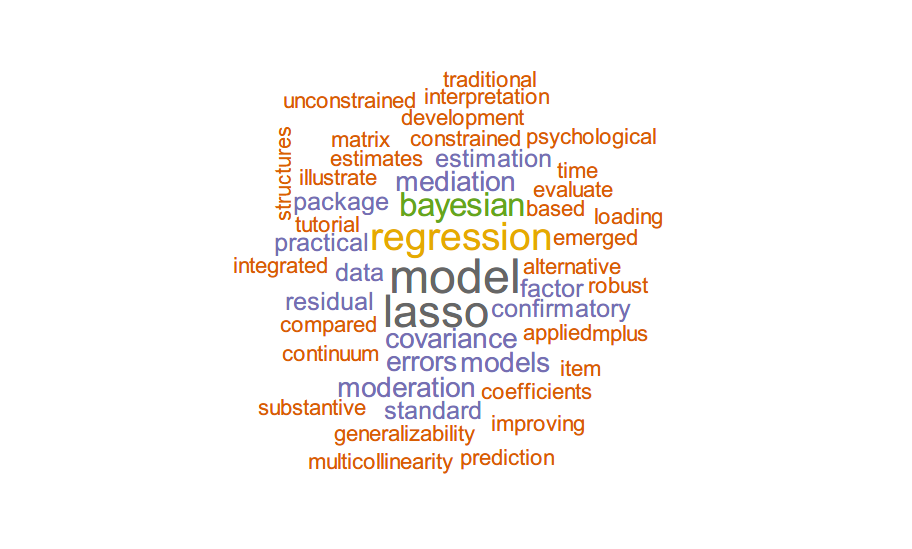

# wordRG()

wordRG() is a simple R function for extracting abstracts on ResearchGate and generating personal research word cloud.  

I built it for practice when learning text mining and for fun.

Why not Google Scholar?

- The abstracts in Google Scholar are often abridged versions with '...' ending.
- I can't access this website stably given my location.

Want to analyze the information of citations and the network of co-authors?

- see R package [scholar](https://cran.r-project.org/web/packages/scholar/) (Yu et al., 2021) which can extract citation data from Google Scholar.

## How to use this function

Here, I will show a quick implementation of this function.  

1. Copy the source code of the function and paste it in R / Rstudio

2. Find your id in ResearchGate

   - Get the WebLink of your profile (e.g., https://www.researchgate.net/profile/XXX-XXX), the id is the content after 'profile/' (e.g., 'XXX-XXX')

3. (Define stopwd, replacewd, wordFreq if necessary)

   - **stopwd**: words with little information about your research (e.g., *results*). 

     - Note that the common stopwords such as 'an' will be automatically deleted. 
     - By the way, sometimes the ResearchGate adds copyright information to the abstracts (e.g., *(PsycInfo Database Record (c) 2020 APA, all rights reserved).*), you can exclude such words in your word cloud by adding them in the stopwd variable.

   - **replacewd**: pairs of words (phrases) with identical meaning. You can use one representative word (phrase) and replace the others.

     ```R
     replacewd
     #     [,1]                           [,2]                         
     #[1,] "structural equation modeling" "sem"                        
     #[2,] "structural equation models"   "sem"                        
     #[3,] "pmm"                          "post hoc model modification"
     #[4,] "moderated"                    "moderation"  
     
     # Words (phrases) in the second column are the representative ones, those in the first column are what you want to replace with representative words (phrases).
     ```

   - **deResearch**: WebLinks of research that will not be include in the word cloud. For example, research that is not highly related to your main work. 

   - **wordFreq**: 'words with frequency below min.freq will not be plotted', quoted from ?wordcloud(). The default setting of wordFreq is the mean of frequencies of all words.

4. Run the function and get the figure

   ```R
   rg_id = "Lijin-Zhang"
   
   stopwd <- c("study", "studies", "method", "methods", "analysis", "approaches", "approach", "results", "research", "step", "procedure", "implementation", "pi", "pa", "lms", "pmm", 'cfa')
   # "pi" and "pa" are abbreviations, I always add the full name before the abbreviation in abstracts, so here I choose to delete the abbreviation   
   
   replacewd <- matrix(c(
     'structural equation modeling', 'sem',
     'structural equation models', 'sem',
     'moderated', 'moderation',
     'least absolute shrinkage and selection operator', 'lasso'
   ), ncol=2, byr=T)
   
   deResearch <- c('https://www.researchgate.net/publication/338896983_Plasma_Neurofilament_Light_Chain_May_Be_a_Biomarker_for_the_Inverse_Association_Between_Cancers_and_Neurodegenerative_Diseases')
   # delete the applied research which is not my main work
   
   wordRG(rg_id, stopwd, replacewd, deResearch)
   #There are 6 research in your profile on ResearchGate. 
   #No abstract found in the following research: 
   #[1] https://www.researchgate.net/publication/336463094_Bayesian_structural_equation_modeling_and_its_current_researches
   
   ```
   
   


You can also modify the source code based on your needs. For example,

- reshape the word cloud based on the logo of your lab
- manually add the abstracts that are not in ReseachGate
- ...

## Source code of the function

```R
if(!require(rvest)) install.packages(pkgs="rvest",repos="http://cran.r-project.org")
if(!require(XML)) install.packages(pkgs="XML",repos="http://cran.r-project.org")
if(!require(dplyr)) install.packages(pkgs="dplyr",repos="http://cran.r-project.org")
if(!require(tidytext)) install.packages(pkgs="tidytext",repos="http://cran.r-project.org")
if(!require(wordcloud)) install.packages(pkgs="wordcloud",repos="http://cran.r-project.org")
if(!require(tm)) install.packages(pkgs="tm",repos="http://cran.r-project.org")

library(rvest)
library(XML)
library(dplyr)
library(tidytext)
library(wordcloud)
library(stringr)
library(tm)


wordRG <- function(rg_id, stopwd = NULL, replacewd = NULL, deResearch = NULL,  wordFreq = NULL){
  
  ## get the WebLink of all the publications  ############################
  rg_url = paste0("https://researchgate.net/profile/", rg_id, "/research")
  content <- read_html(rg_url)
  div_url = content %>% html_nodes('div a') %>% html_attr("href")
  
  div_url_items = NULL
  itemi = 1
  tag = "https://www.researchgate.net/publication/"
  for (i in 1:length(div_url)){
    if(!is.na(div_url[i])){
      if(substr(div_url[i], 1, nchar(tag)) == tag){
        
        div_url_items[itemi] = div_url[i]
        itemi = itemi + 1
      }
    }
  }
  
  div_url_items = div_url_items[seq(1,length(div_url_items),2)]
  cat(paste0('There are ', length(div_url_items), ' research in your profile on ResearchGate. \n'))
  
  # delete the research in deResearch
  loc_de = NULL
  if(!is.null(deResearch)){
	for (dei in 1:length(deResearch)){
		loc_de[dei] = which(div_url_items == deResearch[dei])
	}
	div_url_items = div_url_items[-loc_de]
  }
    
  
  ## get the abstracts of all the publications  ############################
  
  all_abstracts = rep("a", length(div_url_items))
  for (i in 1:length(div_url_items)){
    paper_url = div_url_items[i]
    
    paper_html = read_html(paper_url)
    
    # check whether there is an abstract
    text_all = paper_html %>% 
      html_nodes("div div") %>% html_text() 
    is_ab = which(text_all=="Abstract" | text_all=="Abstract and Figures")

    if(length(is_ab)!=0){

      # text in the abstract and figures
      text_abfig = paper_html %>% 
        html_nodes("div div.nova-c-card__body--spacing-inherit") %>% html_text() 
      
      # text in the figure (if exist)
      text_more = paper_html %>% 
        html_nodes("div div.nova-e-expandable-text__container") %>% html_text() 
      
      # delete the text in the figure (if exist)
      if(length(text_more)>0){ 
        # get the start location of the text of figures
        len_fig_text1 = nchar(text_more[1])
        for (chari in 1:nchar(text_abfig[1])){
          if(str_sub(text_abfig[1], chari, chari+len_fig_text1-1) == text_more[1]){
            loc_figtext = chari
          }
        }
        # delete it 
        abstract = str_sub(text_abfig[1], 1, (loc_figtext-1))
      }else{
        abstract = text_abfig[1]
      } 
      all_abstracts[i] = abstract 
    }    
    
  }
  
  # delete the publications with no abstract information in ResearchGate
  loc_no = which(all_abstracts=="a")
  
  if(length(loc_no)!=0){
	cat_url = paste0('No abstract found in the following research: \n')
	for(loci in 1:length(loc_no)){
		cat_url = paste0(cat_url, '[', loci, '] ', div_url_items[loc_no[loci]], '\n')
	}
	cat(cat_url)
	
	all_ab_selec = tolower(all_abstracts[-loc_no])
  }else{
	all_ab_selec = tolower(all_abstracts)
  }
 
  
  ## Text Mining   ############################
  # replace replacewd
  if(!is.null(replacewd)){
	for (replacei in 1:dim(replacewd)[1]){
		for (itemi in 1:length(all_ab_selec)){
			all_ab_selec[itemi] = str_replace(all_ab_selec[itemi], replacewd[replacei,1], replacewd[replacei,2])
		}
	}
  }
  
  # tidy the text data
  text_df <- tibble(line = 1:length(all_ab_selec),  text = removeNumbers(all_ab_selec))
  
  
  
  
  # cast paragraphs into words
  text_word = text_df %>%
    unnest_tokens(word, text)
  text_word_rep = text_word
  for (i in 1:dim(replacewd)[1]){
	  text_word_rep$word[which(text_word$word==replacewd[i,1])]=replacewd[i,2]
  }

  
  
  if(is.null(stopwd)){
    stopwd <- c("study", "studies", "analysis", "approaches", "approach", "results", "research", "procedure")
    # I just pick up some words with little information in my abstracts.
    # This part can be updated by analyzing your abstracts and extract words with low tf_idf
  }
  
  # word cloud
  text_forcloud = text_word_rep %>%
    filter(!word %in% stopwd)  %>%
    filter(!word %in% stop_words$word)  %>%
    filter(nchar(word)>1)  %>%
    count(word, sort = TRUE)
    
  
  if(is.null(wordFreq)){
    wordFreq = ceiling(mean(text_forcloud$n))
  }
  
  wordcloud(text_forcloud$word, text_forcloud$n, random.color=FALSE, random.order=FALSE, color=brewer.pal(8, "Dark2"), min.freq=wordFreq, scale=c(3, 1))
  
  
}


```


## How to solve internet errors

If there are many publications in your profile and the internet is not stable, you might get the error like  *Error in open.connection(x, "rb") : HTTP error 429.*

Solution: use source code of the function instead of the function


Built 2021-05-15
Update 2021-06-15

Lijin Zhang
